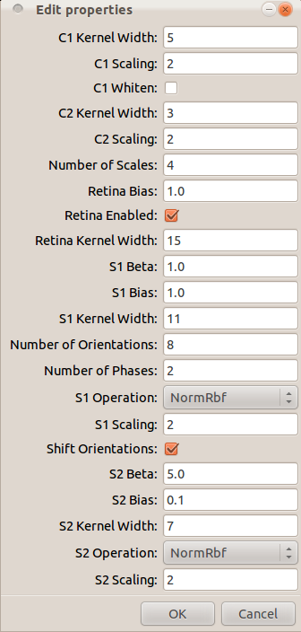

.. _command-edit-glimpse-params:

############################
Command: edit-glimpse-params
############################

.. program:: edit-glimpse-params

The `edit-glimpse-params` command allows a user to choose model parameters
using a GUI and save the result to a file. An options file can be created
using the command::

   edit-glimpse-params > options.dat

This will present the graphical editor shown below, and write the results to
the file ``options.dat``. Model parameters can also be changed using a
graphical editor by passing the option :option:`-e` to the :program:`glab`
command.

   A screenshot of the options editor.

.. note::

   The command ``edit-glimpse-params`` writes the options data to standard
   out, and the syntax for redirecting this data to a file is specific to
   each operating system. However, the example above should work on Linux,
   Unix, and Mac OSX.
