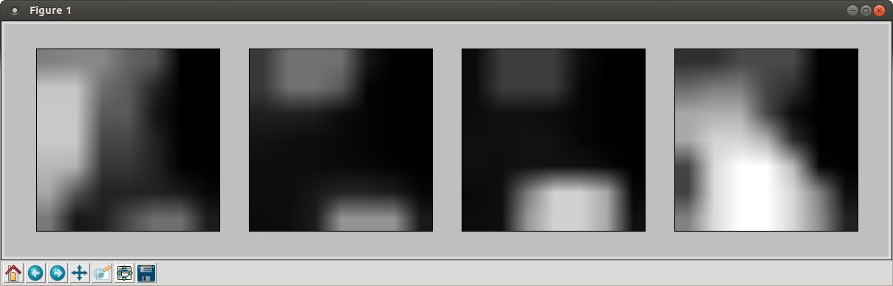
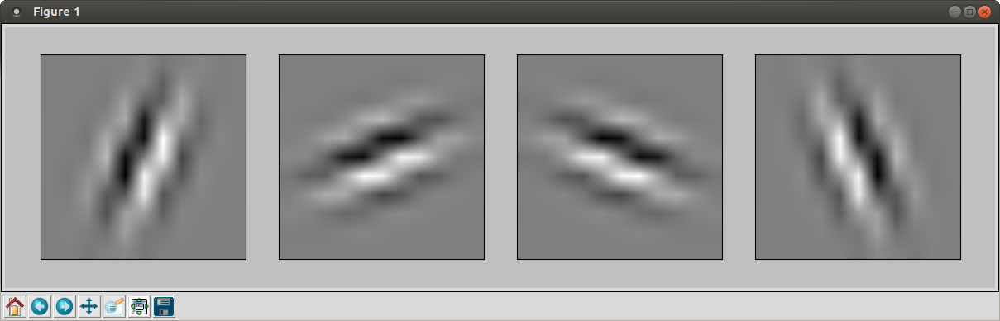
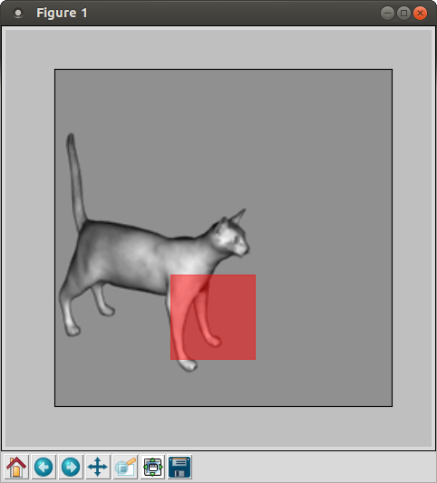
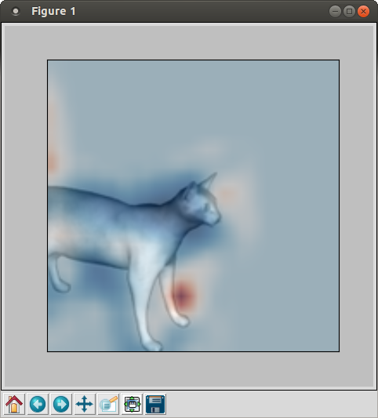
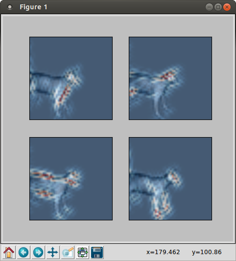
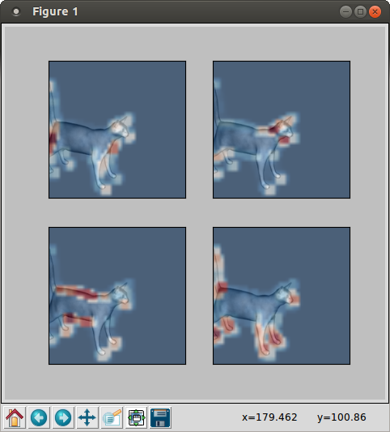

.. _user-guide:

User Guide
**********

.. currentmodule:: glimpse.glab.api

.. _glab:

The easiest way to conduct an experiment is to use the GLAB application
programming interface (API), which provides a simplified MATLAB-like
interface to specify the experimental protocol and drive the computation of
results. This section walks through an example use of this API.

Running an Experiment
=====================

We start by launching IPython, which is the recommended way to use Glimpse.

.. code-block:: sh

  $ ipython --pylab

We then set up the environment::

  >>> from glimpse.glab.api import *

  >>> Verbose(True)

Here, we first import GLAB, and then ask that future commands log their
activity to the console.

.. note::

  Note that the “$” prefix used here denotes a command that is entered at
  the shell. The ``>>>`` denotes text that is submitted to the Python
  interpreter, or written as commands in a script. Lines without either
  marker indicate logging output.

The next step is to specify the experimental protocol and configure the
model. We first tell Glimpse where to find the image corpora. The simplest
way to achieve this is the SetCorpus command, which assumes one
sub-directory per object class. That is, each of these sub-directories
should contain images for only that object class. In this example, we have a
corpus of images in a directory named “cats_and_dogs” with the following
structure::

  cats_and_dogs/
    cat/
      cat1.png
      cat2.png
      cat3.png
      cat4.png
    dog/
      dog1.png
      dog2.png
      dog3.png
      dog4.png

We tell Glimpse to use this corpus with the following command::

  >>> SetCorpus('cats_and_dogs')
  INFO:root:Reading class sub-directories from: cats_and_dogs
  INFO:root:Reading images from class directories:
    ['cats_and_dogs/cat', 'cats_and_dogs/dog']

Here, the system reports that it has read the images for object classes
“cat” and “dog” from disk.

.. note::

   If you would like to learn about Glimpse without using your own image corpus,
   try using the :func:`SetCorpusByName` command.

Next, the model is configured with a set of (in this case 10) imprinted
prototypes::

  >>> ImprintS2Prototypes(10)
  INFO:root:Using pool: MulticorePool
  INFO:root:Learning 10 prototypes at 1 sizes from 4
    images by imprinting
  Time: 0:00:01   |###############|   Speed: 3.07 unit/s
  INFO:root:Learning prototypes took 1.304s

The first line of log output shows that images are being evaluated in
parallel. Since we did not specify a training and testing split, the system
has automatically chosen four (i.e., half) of the images for training and the
remaining four for testing. The next line of log output confirms that the
system imprinted 10 S2 prototypes, using the four images in the training
set. (Here, prototypes are of 1 size, because the model uses only 7x7
prototypes by default. If we had configured the model to use 7x7 and 11x11
prototypes, for example, then we would have imprinted 10 prototypes at 7x7,
and another 10 at 11x11, or 20 prototypes total.)

Finally, the model is used to extract features for each image, and the
classifier is tested in the resulting feature space. ::

  >>> EvaluateClassifier()
  INFO:root:Computing C2 activation maps for 8 images
  Time: 0:00:01   |###############|   Speed: 5.66 unit/s
  INFO:root:Computing activation maps took 1.414s
  INFO:root:Evaluating classifier on fixed train/test
    split on 8 images using 10 features from layer(s): C2
  INFO:root:Training on 4 images took 0.003s
  INFO:root:Classifier is Pipeline(learner=LinearSVC
    [...OUTPUT REMOVED...]
  INFO:root:Classifier accuracy on training set is
    1.000000
  INFO:root:Scoring on training set (4 images) took
    0.001s
  INFO:root:Scoring on testing set (4 images) took 0.001s
  INFO:root:Classifier accuracy on test set is 0.500000

The log output shows that the system is computing model activity through the
C2 layer for all eight images in the corpus. Feature vectors are then
constructed from C2 layer activity only, which provides 10 features per
image (since we used 10 S2 prototypes). The classifier---which we can see is
a linear SVM---is adapted to the training set, and then scored on both the
training and test sets. In this case, accuracy was 100% on the training set,
and 50% on the test set. See the :mod:`GLAB API reference <glimpse.glab.api>`
for the full set of available commands.

Command-Line Experiments
------------------------

The experiment described above can also be run from the command line using
the :mod:`glab <glimpse.glab.cli>` command. This command exposes much of the
functionality of the API, but does so through comand-line arguments. To run
the experiment above, we could enter the following at the command line
(rather than the Python interpreter).

.. code-block:: bash

   $ glab -v -c cats_and_dogs -p imprint -n 10 -E

This results in the same calls that were used in above, and thus should
produce the same log output. Here, the -v flag enables the generation of log
output, the -c flag specifies the image corpus, the -p and -n flags choose
the prototype learning method and number of prototypes, and the -E flag
evaluates the resulting feature vectors with a linear SVM classifier. The
glab command has many more possible arguments, which are documented in the
:mod:`GLAB CLI reference <glimpse.glab.cli>`.

Analyzing Results
=================

Results can by analyzed in much the same way as an experiment is run. Using
the GLAB API, we can first retrieve the set of images and their class labels::

    >>> GetImagePaths()
    array([
      'cats_and_dogs/cat/cat1.png',
      'cats_and_dogs/cat/cat2.png',
      'cats_and_dogs/cat/cat3.png',
      'cats_and_dogs/cat/cat4.png',
      'cats_and_dogs/dog/dog1.png',
      'cats_and_dog/dog/dog2.png',
      'cats_and_dog/dog/dog3.png',
      'cats_and_dog/dog/dog4.png'],
    dtype='|S18')

    >>> GetLabelNames()
    array([
      'cat', 'cat', 'cat', 'cat',
      'dog', 'dog', 'dog', 'dog'],
    dtype='|S3')

This means that the filenames and labels are stored as arrays. The “dtype”
line can be ignored. It simply means that the values in that array are
18-character strings.

Model, Prototypes, and Activity Analysis
----------------------------------------

Information about the “extraction” phase of the experiment---i.e., how
features were extracted from each image---is also available for analysis,
which includes the model's prototypes and parameters. The model parameters
can be printed as follows::

  >>> params = GetParams()

  >>> params
  Params(
    c1_kwidth = 11,
    c1_sampling = 5,
    c1_whiten = False,
    [...OUTPUT REMOVED...]
    s2_operation = 'Rbf',
    s2_sampling = 1,
    scale_factor = 1.189207115,
  )

For example, this shows that an RBF activation function was used for the S2
layer (according to `s2_operation`), and that each scale band is
:math:`2^{1/4}` larger than the scale above it (according to
`scale_factor`). The full set of parameters is documented :ref:`here
<parameters>`.

.. note::

   The experiment's model parameters can be edited with a graphical
   interface using :func:`SetParamsWithGui`. However, this must be done
   before the call to :func:`ImprintS2Prototypes` above.

If a set of S2 prototypes was used, they are available from the
:func:`GetPrototype` command::

  >>> prototype = GetPrototype(0)

  >>> prototype.shape
  (4, 7, 7)

  >>> prototype
  array([[[ 4.08234773e-03, 4.08234773e-03, ...,
            [...OUTPUT REMOVED...]
            4.65552323e-03, 5.46302684e-02 ]]],
        dtype=float32)

Output from the second command shows that each prototype is a seven-by-seven
patch with four bands---i.e., a prototype is a three-dimensional array. The
width of the patch is determined by the model parameters, as seen by the
following::

  >>> params.s2_kernel_widths
  [7]

Remember that an S2 prototype is just a patch of C1 activity. Thus, the
number of bands in a prototype is determined by the number of orientations
used at the S1 and C1 layers. This can be confirmed as follows::

  >>> params.s1_num_orientations
  4

The number of available prototypes depends on the number that were learned.
In our example, 10 prototypes were imprinted, which can be verified as::

  >>> GetNumPrototypes()
  10

As seen above, an S2 prototype is a somewhat complicated object to
visualize, particularly in the form of text output. However, there are other
ways to visualize a prototype. The simplest is to plot the activation at
each band as a set of images, which we do here for the first prototype [1]_. ::

  >>> gray()

  >>> ShowPrototype(0)

.. _prototype-plot:

   Figure 2: S2 prototype bands, with plots corresponding to edge orientations.

.. note::

   Plotting in Glimpse requires the `matplotlib <http://matplotlib.org/>`_
   library.

This results in a plot similar to that shown in :ref:`Figure 2
<prototype-plot>`. Here, active locations are shown in white, while inactive
locations are shown in black. These four plots correspond to the four edge
orientations detected at S1. For reference, the S1 edge detectors [2]_ are
shown as in :ref:`Figure 3 <s1-kernels-plot>` using the following command::

  >>> ShowS1Kernels()

.. _s1-kernels-plot:

   Figure 3: S1 edge detectors.

Unfortunately, the above visualization is not very intuitive. An alternative
approach to visualizing an imprinted prototype is to plot the image patch
from which the prototype was “imprinted”::

  >>> AnnotateImprintedPrototype(0)

.. _annnotate-imprinted-proto:

   Figure 4: Chosen location for the imprinted S2 prototype.

The results are shown in :ref:`Figure 4 <annnotate-imprinted-proto>`. Taken
together, it is much easier to interpret the behavior of this prototype. We
see that it was imprinted from the cat's front leg, which contains a large
amount of vertical energy and very little horizontal energy. This is
reflected in the S2 prototype matrix, which shows light gray and white for
the components corresponding to the two near-vertical detectors, and shows
black for much of the components corresponding to the two near-horizontal
detectors.

Additionally, we can investigate the model activity that was computed for
various layers. Here, we visualize the activity of the S2 layer when the
prototype in :ref:`Figure 2 <prototype-plot>` is applied to the image in
:ref:`Figure 4 <annnotate-imprinted-proto>`. We first need to know where the
first prototype was imprinted, which is given by::

  >>> image, scale, y, x = GetImprintLocation(0)

This returns the image and S2 location (including the scale band) for the
imprinted prototype. Here, the image is specified by its index in the list
of image paths, with other data organized in the same way. To plot the S2
activation for the first prototype on the image and scale from which it was
imprinted, use::

  >>> AnnotateS2Activity(image, scale, 0)

This is shown for our expample in :ref:`Figure 5 <s2-response-plot>`. If
scale is larger than 2 or 3, the image data may be hard to recognize (as it
has been down-sampled multiple times). In this case, try recreating the
plot for smaller values of the `scale` argument.

.. _s2-response-plot:

   Figure 5: S2 response for the prototype visualized in :ref:`Figure 2
   <prototype-plot>`. For reference, the S2 activity is plotted on top of the
   image data.

A similar visualization as above is available for S1 and C1 activity as::

  >>> AnnotateS1Activity(image, scale)

  >>> AnnotateC1Activity(image, scale)

which should produce results similar to :ref:`Figure 6 <s1-response-maps>`
and :ref:`Figure 7 <c1-response-maps>`.

.. _s1-response-maps:

   Figure 6: S1 response maps (enhanced for illustration).

.. _c1-response-maps:

   Figure 7: C1 response maps.

Classifier Analysis
-------------------

In the final stage of an experiment, a classifier is evaluated on the
feature vectors extracted by the model. The information about this stage is
available via two functions: :func:`GetEvaluationLayers` and
:func:`GetEvaluationResults`. First, we can verify that the classifier used
an image representation based on C2 activity::

  >>> GetEvaluationLayers()
  ['C2']

Information about the classifier's performance can be given as::

  >>> results = GetEvaluationResults()

  >>> results.score_func
  'accuracy'

  >>> results.score
  0.5

  >>> results.training_score
  1.0

The first result indicates that the classifier is evaluated based on
accuracy, and the second result gives that accuracy on the set of test
images. The last result gives the accuracy on the set of training images.
The induced classifier can be retrieved as well::

  >>> results.classifier
  Pipeline(steps=[
     ('scaler', StandardScaler([...OUTPUT REMOVED...])
     ('learner', LinearSVC([...OUTPUT REMOVED...])
  ])

The per-image predictions made by the classifier are accessible by using::

  >>> GetPredictions()
  [('cats_and_dog/cat/cat3.png', 'cat', 'dog'),
   ('cats_and_dog/cat/cat4.png', 'cat', 'dog'),
   ('cats_and_dog/dog/dog1.png', 'dog', 'dog'),
   ('cats_and_dog/dog/dog2.png', 'dog', 'dog')]

  >>> GetPredictions(training=True)
  [('cats_and_dog/cat/cat3.png', 'cat', 'cat'),
   ('cats_and_dog/cat/cat4.png', 'cat', 'cat'),
   ('cats_and_dog/dog/dog1.png', 'dog', 'dog'),
   ('cats_and_dog/dog/dog2.png', 'dog', 'dog')]

The first call returned information about images in the test set, while the
second call used the training images. Each entry of the results gives the
image's filename, its true label, and the label predicted by the classifier,
respectively. In our example, the classifier predicted “dog” for all test
images---thus achieving 50% accuracy---while correctly classifying all
training images.

Finally, it may be useful during analysis to compute feature vectors for
images outside the experiment's corpus, which can be done using::

   >>> features = GetImageFeatures('bird/bird1.png')
   >>> features.shape
   (1, 10)

This shows that our existing model with 10 S2 prototypes was used to extract
10 features from a single image. To extract features from several images at
once, use::

   >>> features = GetImageFeatures(['bird/bird1.png', 'bird/bird2.png'])
   >>> features.shape
   (2, 10)

.. [1] Indexing in Python is zero-based, so the first prototype is at index
       zero.

.. [2] We use the terms “prototype” and “kernel” somewhat interchangably.
